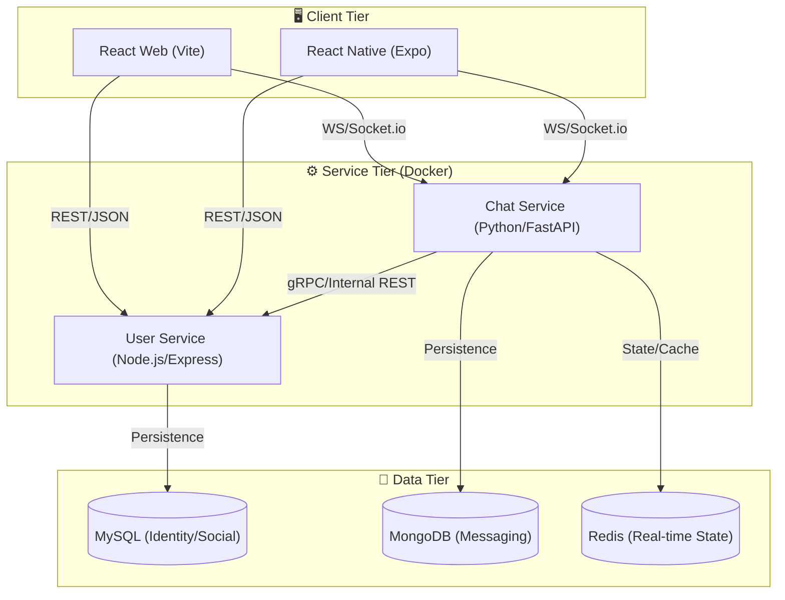
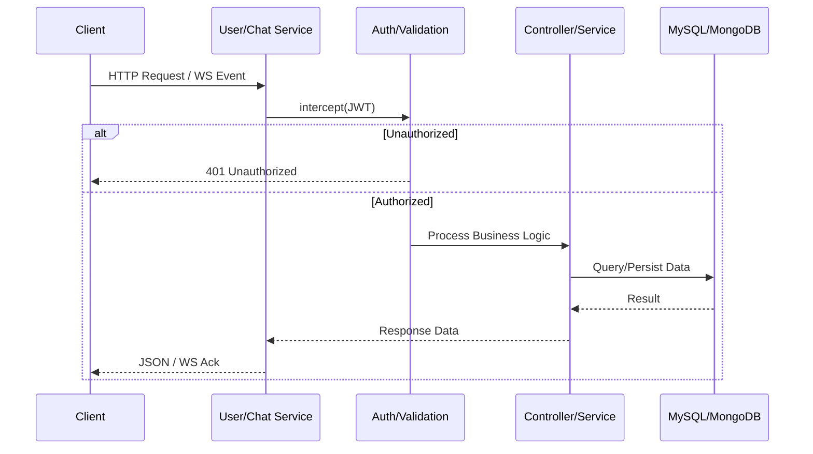
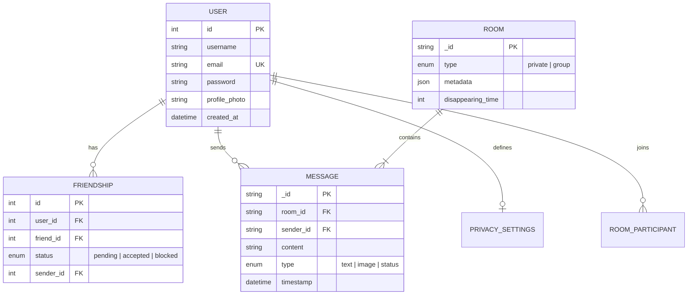
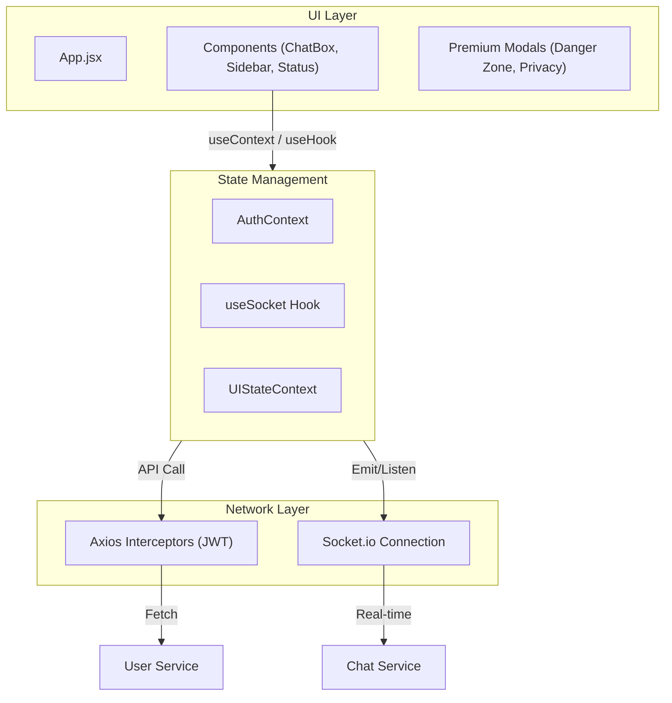
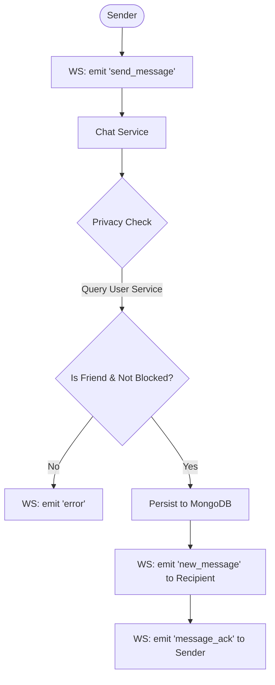

# System Architecture — Pingora Chat

---

## 1. High-Level System Architecture

---

## 2. Backend Request Lifecycle

---

## 3. Database Schema (ERD)

---

## 4. Frontend Architecture (React + Custom Hooks)

---

## 5. Real-time Messaging Flow

---

## 6. Authentication & Authorization

| Component | Logic | Storage |
|---|---|---|
| **Token Type** | JSON Web Token (JWT) | LocalStorage (Web) / SecureStore (Mobile) |
| **Authentication** | `POST /api/auth/login` | MySQL (Bcrypt Hashing) |
| **Authorization** | Bearer Token in Headers | Verified by `express-jwt` or FastAPI Depends |
| **Cross-Service** | Header forwarding | Token validated at service entry |

---

## 7. Frontend Route Map

| Route | Component | Protected | Purpose |
|---|---|---|---|
| `/` | `LandingPage` | ❌ | Introduction and entry |
| `/login` | `LoginPage` | ❌ | User authentication |
| `/chat` | `ChatDashboard`| ✅ | Main messaging interface |
| `/profile`| `ProfilePage` | ✅ | User settings and privacy |
| `/status` | `StatusViewer` | ✅ | View and post stories |

---

## 8. Deployment Strategy (Docker)

- **Isolation**: Each service runs in its own container, sharing a private network.
- **Persistence**: 
    - `mysql_data` -> Local host path mapping.
    - `mongo_data` -> Local host path mapping.
    - `uploads` -> Shared volume for media assets.
- **Service Discovery**: Docker internal DNS allows services to communicate via names (e.g., `http://user-service:5000`).
